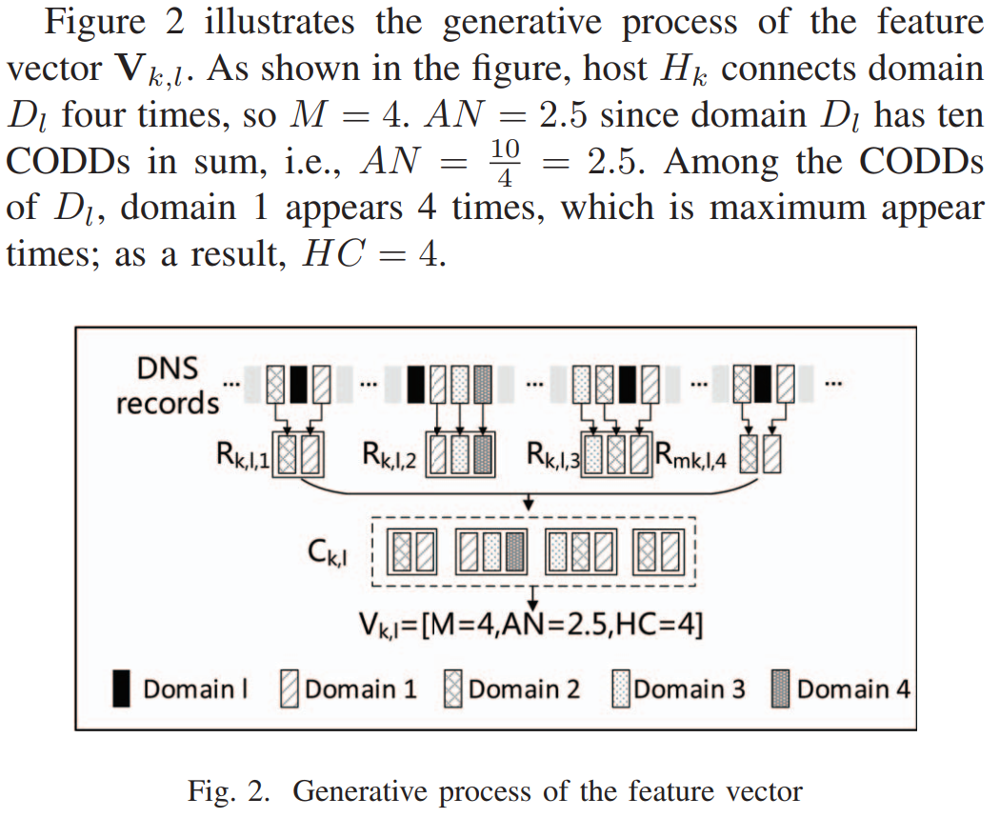
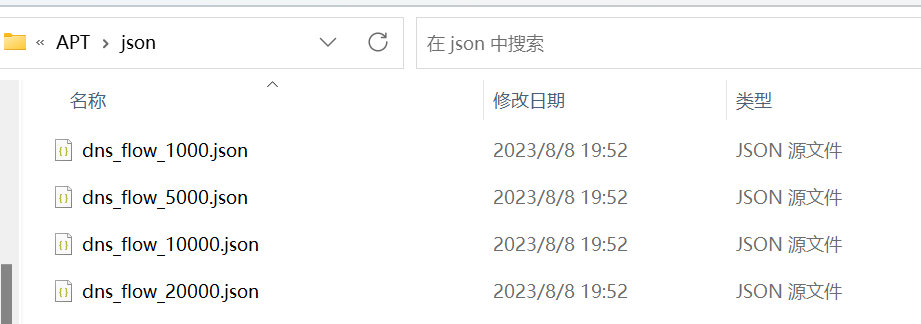

# [Detection of command and control in advanced persistent threat based on independent access | IEEE Conference Publication | IEEE Xplore](https://ieeexplore.ieee.org/document/7511197)阅读与仿真

## 论文梳理

### 概括信息

1. 一个APT攻击C2通信的特征：the access of C&C domains tends to be independent
2. 定义一个新参数CODD ：the concurrent domains in the domain name service(DNS) records to measure the correlations among domains 
3. a 1×3 vector: to represent the relationship between an internal host and an external domain
4. 验证用的数据集：the public dataset provided by Los Alamos National Laboratory  
5. C&C特征：
   1. HTTP-based
   2. Victims connect control center lowly and slowly  
   3. C&C domains are accessed independently  

### C&C特征原理

正常上网会在一定时间段内访问一系列域。分为两种情况：

* 一个正常网页由body和inlined components，例如从其他域获取的广告、多媒体。
* 网上冲浪过程中，通过搜索等手段，访问了一系列域。

C&C通信通常是单独访问目标域，并且目标网页不会有inlined components。

通过DNS记录，可以获取到足够检测C&C的信息。

### CODD

**定义：**CODDs are the domains that are quired by the same host and appear within a given time window in the domain name server records.

在应用中，一定时间内打开的不同域可能混入C&C域，因此可以被当作随机误差，在实践中减小其影响。

一些正规网页能够通过inlined components等产生较大的CODD，网页越复杂，CODD越大。C&C域的CODD明显较小。

### C&C检测方法



#### 1. DNS记录数据预处理

1. 剔除内部DNS服务器的DNS数据。
2. 提取type-A DNS记录
3. 整理成向量$r=<t,h,d>$，依次为请求时间、触发请求的主机、查询的域

#### 2. 建立DNS记录的集合

从给定主机开始，为每个主机域建立一组DNS记录。

假定有$K$个内部主机，主机$H_k$连接了$L$个域。用$M$表示主机$H_k$和域$D_l$的连接次数。

给定时间窗口$2\times\delta$，$R_{k,l,m}$表示与时间戳为$T_m$下的主机$H_k$与域$D_l$的第$m$次连接相关的CODDs集合。排除$r(t)=T_m$的记录，从而剔除访问目标DNS本身的记录。

设定集合$C_{k,l}=\{R_{k,l,i}\}_{i=1,2,\dots,M}$。表示观测期间$H_k$与$D_l$的连接状况。

#### 3. 提取特征

用向量$V_{k,l}=[M,AN,HC]$表示$H_k$与$D_l$的连接，依次为连接次数、CODDs平均值、最高置信水平。对于给定的域$D_w$和集合$C_{k,l}$，置信水平表示为$CI(D_w)=|S_{k,l}|$，$S_{k,l}$为包含与$D_w$相关的DNS记录的子集。

#### 4. 识别C&C域

基于RIPPER分类算法检测。$M$可以衡量活跃水平，缩小检索范围。$AN$、$HC$反映了独立访问特性，越小越可能是C&C。

## 仿真模拟

### 工程结构

```
./json        # 待处理的json数据
./pcap        # 可用的网络流量数据
./txt         # 输出解析的结果
dns_parser.py # 将目标pcap文件转化为json文件，读取处理DNS记录，应用了python库flowcontainer
detect.py     # 提取特征向量并进行分类
```

```
read.py       # zeek数据集转换为json工具
```


### 数据集

1. [网络流量领域公开数据集及工具库_网络流量数据集_Icoding_F2014的博客-CSDN博客](https://blog.csdn.net/jmh1996/article/details/90666499)

   初步采用aptminer提供的一个流量数据集，尝试进行解析，处理得到合适的DNS信息。数据集格式为pcap使用工具[jmhIcoding/flowcontainer: 从pcap获取流的基本信息工具 (github.com)](https://github.com/jmhIcoding/flowcontainer)进行解析。该数据集较小，无法测试仿真的正确性。

2. [dns.log — Book of Zeek (git/master)](https://docs.zeek.org/en/master/logs/dns.html)

   尝试了zeek的DNS数据集，由于目前的程序无法快速处理极大的数据量，仅测试不高于20000条的dns记录。该数据集较大，能够很好地体现数据的周期性，测试效果优良。由于没有标注，无法定量的计算正确率。

3. [Botnet 2014 | Datasets | Research | Canadian Institute for Cybersecurity | UNB](https://www.unb.ca/cic/datasets/botnet.html)

   一个僵尸网络数据集，标注好了恶意ip。使用其中一个数据集，25883个dns记录。

   

### 分类算法

论文分类过程的参考文献[The WEKA data mining software: an update: ACM SIGKDD Explorations Newsletter: Vol 11, No 1](https://dl.acm.org/doi/abs/10.1145/1656274.1656278)

论文通过WEKA软件，利用RIPPER算法得到了两条规则。由于目前缺乏标注过的数据集，笔者暂时无法进行WEKA的分类训练，因此先采用论文中的结论。

### 问题记录

1. 在DNS的回答报文中通常包含多个回答（例如一个域名对应多个IP地址、多个别名），是否需要分为不同的DNS记录？

   > 从测试结果来看，论文中注重的concurrent domains是访问一个复杂网页，对每个组件发出一个DNS报文。以秒为精度的情况下，几乎在同一时间发送。
   >
   > 如果将同一个DNS记录中多个目标域拆分成多个DNS记录，将会污染上述数据，因此先只提取第一个A类型对应的域名。

2. 检测效果与数据规模的影响

   > 在测试中，曾经用同一批的数据由小批量到大批量测试。发现一些在小批量检测出来的疑似C2域名，在大批量检测中被归类为普通。就原理来看，应该是随着数据规模增大，同一个域名的访问量增加，置信度将趋于准确。因此理论上代码对超大规模的DNS数据可能表现出优良的性能，很遗憾暂时无法提升代码性能，测试$10^5$以上规模的数据。

### 仿真结果和评估



从zeek的数据集[dns.log — Book of Zeek (git/master)](https://docs.zeek.org/en/master/logs/dns.html)中摘选了按时间排序的1000、5000、10000、20000的数据，转换为代码规定的json格式，通过`detect.py`进行特征提取和检测。

在提取特征的过程中，除了简单的时间和域名外，往往需要对多个dns记录进行匹配，计算置信度。对于$n$个dns数据，提取特征的时间复杂度大概能达到$O(n^3)$。此外，由于特征提取过程依赖dns记录的时间排序，因此无法简单地应用多线程改进效率。因此作为实验室实践，笔者仅仅跑了以上测试样例。

仿真结果符合预期。首先，面对大量的数据，算法能够识别少数的异常dns记录，这是符合统计学规律的。由于缺乏合适的标注过的dns数据集，笔者无法从具体案例上分析算法的准确率。在本次仿真测试中，获取到的疑似C2服务器域名中，有`dtm-dre.platform.dbankcloud.cn`（华为云）这样的特殊网络服务，这是因为云盘服务区别于正常网页，本身CODD较小。也有`www.qq.com`（腾讯网）这样的正常网页，这属于特殊的用户使用情况。以上两种情况，一方面可以通过部署白名单即可简单解决，另一方面，随着数据集的增大，检测结果趋于准确，从而排除。此外，在样例中也捕获到非正常网页，笔者认为这是算法成功找到的疑似C2样例。

当然，本次仿真相比论文作者做的工作，略显简陋。例如特征参数的阈值，作者是通过对标注好的dns数据集进行训练，得到的参数。  显然，面对不同风格的apt攻击，固定的参数不能发挥算法最好的效果。

### 总结思考

1. 整个方法基于DNS记录，如果恶意软件直接通过IP地址访问，将无法检测。
2. 论文中没有考虑主机对DNS缓存，导致同一网站第二次访问没有DNS记录。可能存在影响。
3. 存在一些特殊情况，如云盘服务，会产生一些规律性DNS记录，并且所指向的网页不是面向访客的网页，因此CODD会很小。因此，需要维护一个合适的白名单。、
4. 笔者复现的代码效率较低。初步来看，应当改进目前的数据结构。需要优化时间相关的特征提取，实现多线程处理。